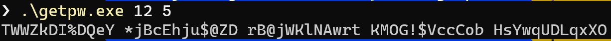

# Get Password (getpw)

Personal use, random password generate written in c++.

It runs in the termianl and takes 2 arguments...

```
.\getpw.exe $password_length $number_of_passwords
```

Here is an example that generates 5 passwords that are 12 characters long:
```
.\getpw.exe 12 5
```

Output:
